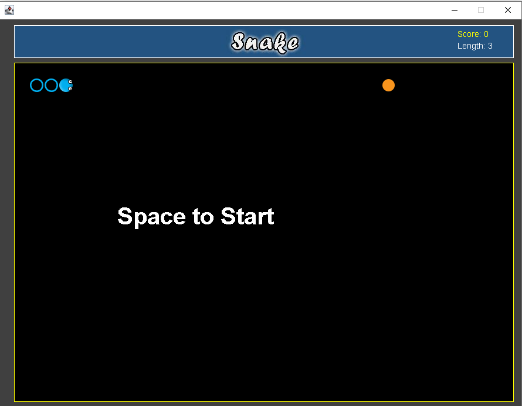

<h1 align="center">Welcome to "2D Snake" with Java 👋</h1>

  
  
  

> Created a beakout game using Java using JPanel, KeyListener, Action Listener, and Color libraries.

### 🏠 [Homepage](https://github.com/OptimisticTrousers/Java2DSnake)

## Author

👤 **Tony Isern **

* Github: [@OptimisticTrousers ](https://github.com/OptimisticTrousers )
* LinkedIn: [@ https:\/\/www.linkedin.com\/in\/tony-isern-9717a0189\/]

## Installation

* Extract .jar file or use class files included, then run the main method class. Use git clone to clone repo into your IDE.

